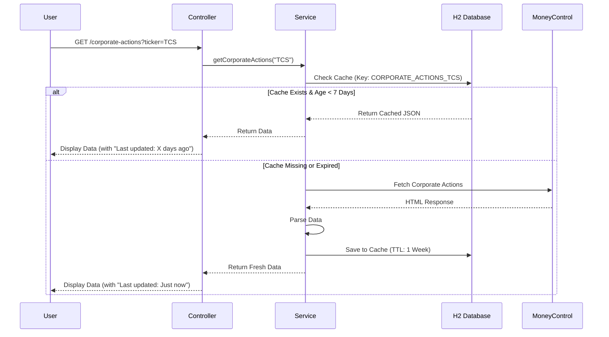

# Screener Data Fetcher

A powerful Spring Boot application designed to automate the extraction, analysis, and visualization of financial data from multiple sources like [Screener.in](https://www.screener.in/), [Moneycontrol](https://www.moneycontrol.com/), and Google News. It features a modern, dark-themed web interface for deep diving into stock metrics, comparing competitors, and getting AI-powered insights.

## 🚀 Features

### 1. **Ticker Analysis & Comparison**
*   **Deep Dive**: Fetch detailed financial ratios, pros/cons, and quarterly results.
*   **Competitor Comparison**: Compare multiple tickers side-by-side with color-coded tables and dynamic charts (Bar, Radar, Polar Area).
*   **Visualizations**: Interactive charts powered by Chart.js to visualize key metrics like P/E, ROCE, Sales Growth, etc.

### 2. **Geo Analysis**
*   **Revenue Split**: Automatically extracts and visualizes the revenue breakup by geography (e.g., USA, Europe, India) or business segment.
*   **Region-Specific News**: Fetches recent news tailored to the company's operating regions to give context to the numbers.

### 3. **Corporate Actions**
*   **Comprehensive Data**: View Dividends, Bonus issues, Stock Splits, and Rights issues.
*   **Smart Caching**: Data is cached in a local H2 database for **1 week** to minimize external API calls and improve performance.
*   **Manual Refetch**: "Refetch" button to force update the data if needed.
*   **Timeline**: Clear distinction between Upcoming and Previous actions.

### 4. **AI-Powered News Analysis**
*   **Smart Summaries**: Uses **Google Gemini Pro** to analyze recent news and generate concise, bullet-point summaries.
*   **Sentiment Analysis**: Categorizes news into "Positive", "Negative", or "Neutral" impact.
*   **Subsidiary Tracking**: Automatically identifies and tracks news related to key subsidiaries.

### 5. **Screener.in Integration**
*   **Seamless Login**: Log in with your Screener credentials directly from the app to access premium data.
*   **Cookie Management**: Handles session management and CSRF tokens automatically.

---

## 🛠️ Technical Stack

*   **Backend**: Java 21, Spring Boot 3.x
*   **Database**: H2 Database (Embedded, Persistent)
*   **Web Scraping**: Jsoup
*   **Excel Processing**: Apache POI
*   **AI/LLM**: Google Gemini Pro API
*   **Frontend**: HTML5, CSS3 (Custom Dark Theme), JavaScript (Vanilla)
*   **Visualization**: Chart.js, Chart.js DataLabels

---

## 🏗️ Architecture

### System Overview

```mermaid
graph TD
    User[User / Browser] <-->|HTTP Requests| Controller[Spring Boot Controller]
    
    subgraph "Backend Services"
        Controller <--> ScreenerService[Screener Analysis Service]
        Controller <--> NewsService[News Analysis Service]
        
        ScreenerService <--> MCService[MoneyControl Service]
        ScreenerService <--> CacheService[Cache Service]
        
        NewsService <--> LLMService[LLM Service (Gemini)]
        NewsService <--> GoogleNews[Google News RSS]
    end
    
    subgraph "Data Sources"
        ScreenerService <-->|Scrape| ScreenerWeb[Screener.in]
        MCService <-->|Scrape| MCWeb[Moneycontrol.com]
    end
    
    subgraph "Storage"
        CacheService <-->|Persist| H2DB[(H2 Database)]
    end
```

### Corporate Actions Caching Flow



---

## 🏁 Getting Started

### Prerequisites
*   Java 21 or higher
*   Maven (Wrapper included)

### Installation

1.  **Clone the repository**
    ```bash
    git clone https://github.com/nimishg5/Screener-Data-Fetcher.git
    cd Screener-Data-Fetcher
    ```

2.  **Build the project**
    ```bash
    ./mvnw clean install
    ```

3.  **Run the application**
    ```bash
    ./mvnw spring-boot:run
    ```

4.  **Access the App**
    Open your browser and go to: [http://localhost:8080](http://localhost:8080)

---

## 📖 Usage Guide

### 1. Dashboard & Login
*   Upon opening, you can use the app anonymously for basic data.
*   For advanced data, enter your **Screener.in** credentials in the login box.

### 2. Comparing Stocks
*   Enter tickers (e.g., `TCS`, `INFY`) in the search bar.
*   Click **Add** to create a list of chips.
*   Click **Compare** to generate the comparison table.
*   Switch to the **Chart** tab to visualize the data.

### 3. Corporate Actions
*   After comparing, click the **Corporate Actions** tab.
*   Select a ticker from the sub-tabs.
*   View upcoming and past dividends, splits, etc.
*   Use the **🔄 Refetch** button to force a data update.

### 4. Geo & News Analysis
*   Click the **Geo Analysis** tab.
*   The app will parse the company's revenue sources and display a pie chart.
*   Below the chart, you'll see AI-summarized news relevant to those specific geographies.

---

## 📂 Project Structure

```
src/main/java/com/example/screen/data/fetcher/
├── controller/       # REST Controllers (API Endpoints)
├── entity/           # JPA Entities (CacheData)
├── repository/       # JPA Repositories (H2 Access)
├── service/          # Business Logic (Scraping, Caching, AI)
└── ScreenDataFetcherApplication.java  # Main Entry Point

src/main/resources/
├── static/           # Frontend Assets (HTML, CSS, JS)
└── application.yml   # Configuration
```

## 🤝 Contributing

Contributions are welcome! Please feel free to submit a Pull Request.